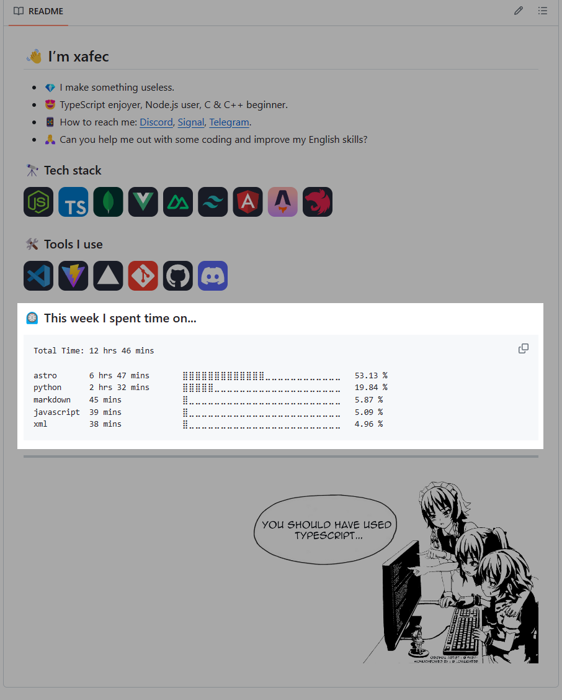

# CodeTime Stats in Readme

Display your [CodeTime](https://codetime.dev) stats on your Profile Readme:



## How to Update your Readme

To incorporate CodeTime stats in your README, add the following comment:

```md
<!--START_SECTION:codetime-->
<!--END_SECTION:codetime-->
```

These lines will serve as entry points for this action.

## Setup

To use CodeTime Stats in your README, you need to obtain a cookie token from CodeTime and add it to your repository secrets. Follow these steps:

1. Visit the [CodeTime website](https://codetime.dev) and log in to your account.
2. Open the developer tools in your browser (usually by right-clicking on the page and selecting `Inspect` or `Inspect Element`).
3. Navigate to the `Network` tab in the developer tools.
4. Refresh the page to view the network requests.
5. Find a request named `top?field=platform&minutes...` and select it.
6. In the request details, navigate to the `Headers` section.
7. Locate the cookie and copy everything after CODETIME_SESSION=. For example, if you see `CODETIME_SESSION=MASDkhiagbdyhoi21d89y21bndsgaDPADHoiha98yd9qw=`, `MASDkhiagbdyhoi21d89y21bndsgaDPADHoiha98yd9qw=` is the token.

After obtaining the cookie token, add it to your repository secrets:

1. Navigate to your repository on GitHub.
2. Select the `Settings` tab.
3. In the left sidebar, click on `Secrets and variables` and `Actions`.
4. Click on `New repository secret`.
5. Provide a name for the secret (e.g., `CODETIME_COOKIE_KEY`) and paste the cookie token value in the `Value` field.
6. Click on `Add secret` to save it.

### Profile Repository

**No need for a GitHub Access Token as GitHub Actions already provides one for you.**

Here's a sample workflow file to get you started:
```yml
name: CodeTime - Readme

on:
  schedule:
    # runs every 6 hours on UTC
    - cron: "0 */6 * * *"

jobs:
  update-readme:
    name: CodeTime's Graph in Readme
    runs-on: ubuntu-latest
    steps:
      - uses: xafec/codetime-readme@main
        with:
          CODETIME_COOKIE_KEY: ${{ secrets.CODETIME_COOKIE_KEY }} # required
          DAYS_COUNT: "7" # optional
```

## Contributions

Contributions to this project are welcome. Any form of help is greatly appreciated ❤️

---

**Note:** I'm not particularly proficient in Python and Docker, so if you find this project interesting, feel free to develop it further. This project was created based on the [waka-readme](https://github.com/athul/waka-readme/tree/0.1.1) version 0.1.1.

---
[English](./README.md) | [Русский](./README.ru.md)
