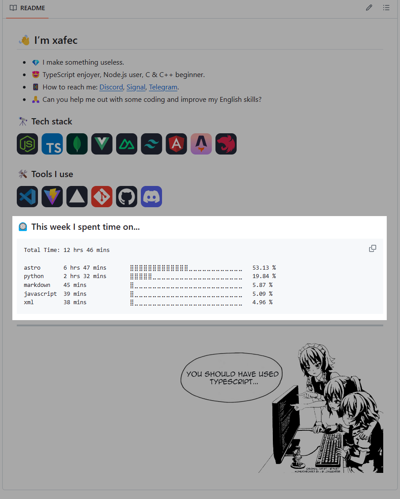

# Статистика CodeTime в Readme

Отображайте свою статистику [CodeTime](https://codetime.dev) в вашем профиле Readme:



## Как обновить ваш Readme

Чтобы включить статистику CodeTime в ваш README, добавьте следующий комментарий:

```md
<!--START_SECTION:codetime-->
<!--END_SECTION:codetime-->
```

Эти строки будут служить точками входа для этого действия.

## Настройка

Чтобы использовать статистику CodeTime в вашем README, вам нужно получить токен cookie от CodeTime и добавить его в секреты вашего репозитория. Следуйте этим шагам:

1. Посетите сайт [CodeTime](https://codetime.dev) и войдите в свой аккаунт.
2. Откройте инструменты разработчика в вашем браузере (обычно это делается кликом правой кнопкой мыши на странице и выбором `Inspect` или `Inspect Element`).
3. Перейдите на вкладку `Network` в инструментах разработчика.
4. Обновите страницу, чтобы увидеть сетевые запросы.
5. Найдите запрос с именем `top?field=platform&minutes...` и выберите его.
6. В деталях запроса перейдите в раздел `Headers`.
7. Найдите cookie и скопируйте все после CODETIME_SESSION=. Например, если вы видите `CODETIME_SESSION=MASDkhiagbdyhoi21d89y21bndsgaDPADHoiha98yd9qw=`, `MASDkhiagbdyhoi21d89y21bndsgaDPADHoiha98yd9qw=` - это токен.

После получения токена cookie добавьте его в секреты вашего репозитория:

1. Перейдите в ваш репозиторий на GitHub.
2. Выберите вкладку `Settings`.
3. В левой боковой панели нажмите на `Secrets and variables` и `Actions`.
4. Нажмите на `New repository secret`.
5. Укажите имя для секрета (например, `CODETIME_COOKIE_KEY`) и вставьте значение токена cookie в поле `Value`.
6. Нажмите на `Add secret`, чтобы сохранить его.

Действие выполняется каждые 6 часов по UTC.

### Репозиторий профиля

**Нет необходимости в токене доступа GitHub, так как GitHub Actions уже предоставляет его для вас.**

Вот пример файла рабочего процесса, чтобы начать:
```yml
name: CodeTime - Readme

on:
  schedule:
    - cron: "0 */6 * * *"

jobs:
  update-readme:
    name: CodeTime's Graph in Readme
    runs-on: ubuntu-latest
    steps:
      - uses: xafec/codetime-readme@v1.0
        with:
          CODETIME_COOKIE_KEY: ${{ secrets.CODETIME_COOKIE_KEY }}
```

## Вклад

Вклад в этот проект приветствуется. Любая форма помощи очень ценится ❤️

---

**Примечание:** Я не особенно хорош в Python и Docker, поэтому если вам интересен этот проект, не стесняйтесь развивать его дальше. Этот проект был создан на основе [waka-readme](https://github.com/athul/waka-readme/tree/0.1) версии 0.1.

---
[English](./README.md) | [Русский](./README.ru.md)
